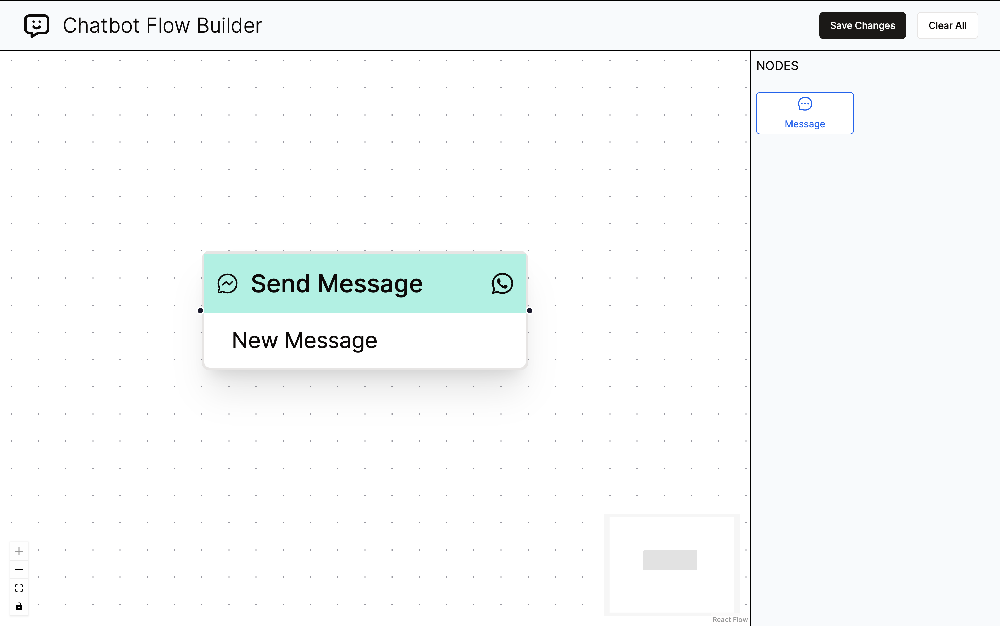

# Chatbot Flow Builder

This project is a simple, extensible Chatbot flow builder built with NextJS and React Flow. It allows you to visually design chatbot conversations by connecting message nodes in the desired order.

Check out the [Live Version](https://chatbot-flow-builder-ishita.vercel.app/)



## Getting Started:

1. Clone the Repository:

```bash
git clone https://github.com/ishita-kohli/chatbot-flow-builder.git
```

2. Install Dependencies:

```bash
cd chatbot-flow-builder
npm install
```

3. Run the Development Server:

```bash
npm run dev
```

This will typically start the server on http://localhost:3000/ by default (you might need to adjust the port if your system uses a different default).

## Key Features

- **Text Node:** This node is currently the only supported message type. You can add multiple Text Nodes to create a complex flow.

- **Extensible Nodes Panel:** This panel houses all available node types. While it currently only contains Text Node, the design is flexible to accommodate future node additions.

- **Drag-and-Drop Functionality:** Add nodes to the flow by dragging them from the Nodes Panel and dropping them onto the canvas.

- **Edges:** Edges connect nodes together, defining the flow of conversation.

- **Source and Target Handles:** Each node has a source handle (can have only one outgoing edge) and target handles (can have multiple incoming edges).

- **Properties Panel:** When a Text Node is selected, the Nodes Panel is replaced with the Settings Panel, allowing you to edit the node's text.

- **Save Button:** Saves the designed flow. The button prevents saving if there are multiple nodes with empty target handles, ensuring a valid flow structure.

## Technologies Used:

- React
- React Flow
- NextJS
- TailwindCSS
- shadcn/ui
